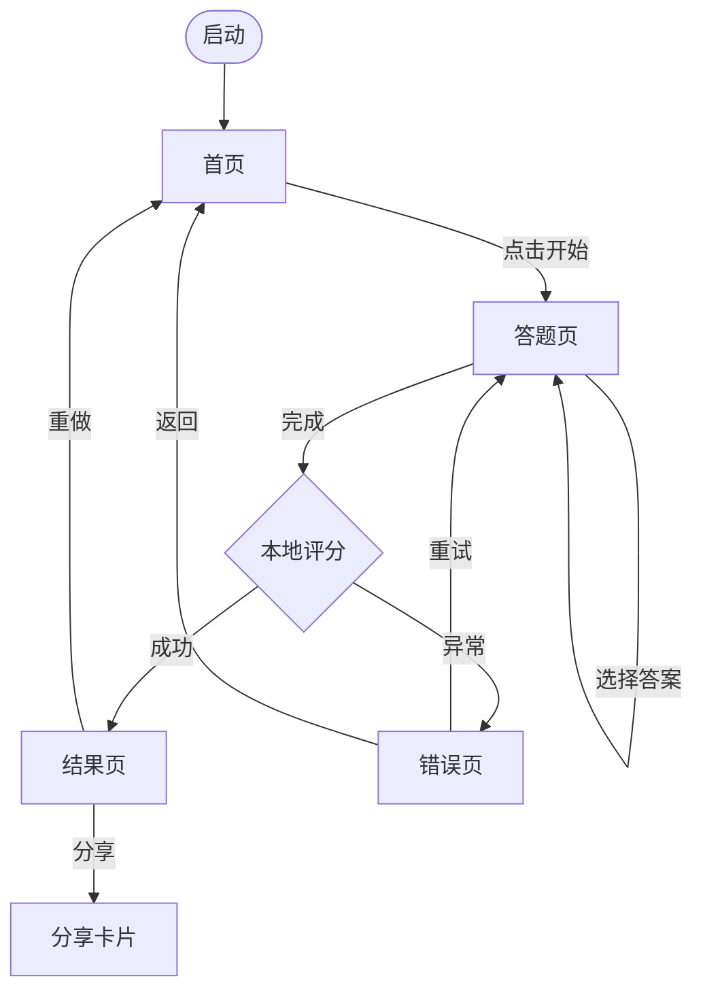

# Spec Coding System for Solo AI Developer on Windows

> 版本：v1.0｜适用：Windows 11 + Trae/Cursor + GPT/Claude｜目标：一人开发不烂尾、不返工、可上线

------

## 0. 使用说明

这份文档是个人开发者用 AI 编程工具做项目的**全流程操作手册**。把它保存为项目根目录下的 `spec-coding.md`，每次开新项目时复制一份到新项目根目录，按章节顺序推进。每个阶段必须产出对应交付物才进入下一阶段，禁止跳步。每个阶段交付物如下：阶段一交付 `SPEC.md`（一页纸需求）；阶段二交付 `docs/design.md`（页面+流程+数据）；阶段三交付 `ADR/0001-stack.md`（技术选型记录）；阶段四交付可运行的空项目骨架；阶段五持续产出代码 + commit；阶段六交付 `tests/smoke.md` + 关键路径测试脚本；阶段七交付上线版本 + `docs/deploy.md`。如果当前项目跳过某阶段（如纯本地工具不需要部署），必须在 `SPEC.md` 顶部显式声明跳过原因，不得隐式跳过。

------

## 1. 项目总原则

1. **Spec first（规格先行）**：没有写下来的需求等于不存在；没有验收标准的功能等于无限蔓延。**动作**：每个新项目第一件事是创建 `SPEC.md` 并写完阶段一的输出物模板，写不完就不开始写代码。
2. **Human decides, AI executes（人做判断，AI 做执行）**：目标、范围、取舍、风险、上线决策由你定；代码草案、检查清单、模板填充交给 AI。**动作**：每次让 AI 工作前，先在心里回答"我是在让它判断还是让它执行"，如果是判断，自己先做完决策再让 AI 写。
3. **Small batch（小批量）**：AI 一次改的文件越多，引入隐藏 bug 的概率越大。**动作**：单次 AI 任务限定在 ≤3 个文件、≤200 行改动；超出就拆任务。
4. **Evidence over fluency（证据优先于流畅度）**：AI 说得顺不等于对，幻觉 API 是头号杀手。**动作**：每个 AI 给出的库方法、CLI 命令、配置字段，在合入前到官方文档/npm 页面/`--help` 验证一次存在性。
5. **Windows first（Windows 优先适配）**：你不是在 Linux 写代码，所有路径、命令、编码、依赖必须按 Windows 行为兜底。**动作**：项目放 `D:\\dev\\project-name`，强制 LF + UTF-8，npm scripts 用 `cross-env`/`rimraf` 等跨平台包。
6. **Working software first（先跑通再优化）**：能运行的丑代码 > 不能运行的优雅代码。**动作**：MVP 阶段允许硬编码、允许复制粘贴、允许单文件 500 行；先把端到端链路跑通再回头重构。
7. **Decision record（决策留档）**：技术选型不写下来，三天后会被 AI 或自己推翻重做。**动作**：每个影响超过 1 天工作量的决策写一份 ADR 放 `ADR/` 目录，编号递增。
8. **Check before merge（合入前过检查表）**：AI 代码看起来对≠跑得对≠跑得稳。**动作**：把 6.3 检查清单贴到 commit 前，逐项确认再 `git commit`。
9. **Rollback ready（永远准备回滚）**：个人开发没有人帮你救场，回滚是最便宜的保险。**动作**：每次部署前打 git tag，记录上一个可运行版本号，回滚命令写在 `docs/deploy.md` 顶部。
10. **Done means deployed（做完=上线）**：没上线的项目不算项目。**动作**：MVP 阶段就把部署链路打通（哪怕只是 Vercel preview），别等"做完了再部署"。

------

## 2. 阶段一：需求理解与问题定义

**阶段目标**：把一个模糊想法变成一页纸可执行需求文档（`SPEC.md`），让你和 AI 都对"做什么、不做什么、做到什么程度算成功"达成一致。

**输入物**：你脑子里的想法、任何参考产品、用户反馈片段、毕业任务书、客户口头描述。

**AI 协作方式**：把模糊想法粘给 AI，让 AI 用反问的方式帮你拆解（不是直接生成需求）；让 AI 列竞品功能清单、列可能的非功能需求漏项、列用户可能的异常使用场景。

**人必须判断的内容**：核心价值主张、目标用户具体是谁、MVP 边界、明确不做什么、成功标准。这五项 AI 给的建议只能参考，最终你拍板。

**失败模式与防御动作**：

- 失败：需求膨胀（"顺便加个登录、加个排行榜"）→ 防御：每加一个功能，问"删掉它 MVP 还能跑吗？能跑就删"。
- 失败：伪需求（你以为用户需要，实际没人用）→ 防御：找 3 个真实目标用户口头描述使用场景，描述不出来的功能砍掉。
- 失败：AI 顺从你（你说啥它都说好）→ 防御：每次让 AI 用"反方角色"挑刺，例如"假设你是产品总监，找出这个需求文档的 5 个最大风险"。

**输出物模板（保存为 `SPEC.md`）**：

```markdown
# 项目名称
## 一句话定义
[名词] 帮 [谁] 在 [场景] 中 [做什么]，从而 [获得什么结果]。

## 目标用户
- 主要用户：[具体画像，年龄/职业/技能/痛点]
- 次要用户：[可选]
- 不是给谁用的：[显式排除]

## 用户痛点（用户原话）
1. "..."
2. "..."
3. "..."

## 核心场景（3 个以内）
1. 用户 X，在 Y 情境下，打开产品做 Z，得到 W
2. ...

## MVP 功能（5 项以内）
- [ ] F1: ...
- [ ] F2: ...

## 明确不做什么（至少 5 项）
- ❌ 不做用户登录系统（用本地存储/匿名 ID）
- ❌ 不做支付
- ❌ 不做多语言
- ❌ 不做后台管理
- ❌ 不做数据分析

## 成功标准（可量化）
- 我自己用一周不卡壳
- 至少 3 个真实用户用过且给反馈
- 端到端跑通：[起点] → [终点]

## 非功能需求
- 性能：首屏 ≤ 3s（4G 网络）
- 安全：无敏感数据 / 有则加密存储
- 隐私：[是否收集用户数据，存哪]
- 兼容性：[浏览器/微信版本/操作系统]
- 部署环境：[Vercel / 微信云开发 / 本地]

## 跳过阶段声明
- [ ] 跳过部署（仅本地工具）：原因 ___
- [ ] 跳过测试章节：原因 ___
```

**AI Prompt 模板（把模糊想法转成 [SPEC.md](http://SPEC.md)）**：

```
角色：你是一个专门帮个人开发者把模糊想法压缩成可执行需求的产品教练。
任务：基于我下面的描述，先用 5 个反问帮我厘清问题，然后输出符合下面模板的 SPEC.md。
约束：
- 不要顺从我；如果我的需求有膨胀、伪需求、技术不可行风险，直接指出
- MVP 功能必须 ≤5 项，不做清单必须 ≥5 项
- 成功标准必须可量化，不要"提升体验"这类空话
- 我的环境：个人开发，Windows 11，Trae+AI，技术栈偏好 [填你的栈]
我的描述：[粘贴你的想法]
模板：[粘贴上面的 SPEC.md 模板]
```

------

## 3. 阶段二：产品设计与信息架构

**阶段目标**：在写任何 UI 代码前，先确定页面清单、用户流程、数据模型、异常路径。**核心原则：先数据后界面，先流程后控件**。

**页面/模块清单**（示例格式，保存到 `docs/design.md`）：

| 页面 ID | 名称   | 进入方式       | 主要操作       | 数据来源    | 离开去向 |
| ------- | ------ | -------------- | -------------- | ----------- | -------- |
| P1      | 首页   | 启动/Logo 点击 | 选择功能       | 静态        | P2/P3    |
| P2      | 答题页 | 首页"开始"     | 选答案、下一题 | 本地题库    | P3       |
| P3      | 结果页 | 答题完成       | 查看分数、分享 | P2 计算结果 | 首页     |

**用户流程（Mermaid 模板）**：



**信息架构**：用层级树画出"应用→页面→区块→数据字段"的归属关系，避免出现"这个数据放哪个页面拿"的反复问题。

**数据对象草图（先于数据库表设计）**：

```tsx
// docs/design.md 中以代码块形式展示
type User = { id: string; nickname: string; createdAt: number }
type QuizAnswer = { questionId: string; choice: 'A'|'B'|'C'|'D'; timestamp: number }
type QuizResult = { userId: string; score: number; level: 'low'|'mid'|'high'; advice: string[] }
```

**异常路径必须穷举**：网络断开、请求超时、权限拒绝、数据为空、数据格式错、并发冲突、用户中途退出、二次重复提交、AI/第三方 API 限流。每条异常都要在流程图中有对应分支。

**空状态/错误状态/加载状态**：每个数据列表页必须设计三态——空（无数据时的引导）、错（加载失败的重试入口）、载（骨架屏或加载提示）。在 `docs/design.md` 中为每个动态页面列出三态文案和触发条件。

**禁止动作**：不要先让 AI 写 UI 代码。先把上面的页面清单、流程图、数据模型、三态写完，再让 AI 基于这些产出 UI。否则 UI 改 → 数据改 → 流程改的连锁返工会吃掉你 50% 时间。

------

## 4. 阶段三：技术选型与 ADR

**技术选型决策矩阵模板**（每个候选打 1-5 分，加权求和）：

| 维度                                            | 权重 | 候选 A | 候选 B | 候选 C |
| ----------------------------------------------- | ---- | ------ | ------ | ------ |
| ---                                             | ---: | ---:   | ---:   | ---:   |
| 学习成本（你当前掌握度，5=已熟）                | 1.5  |        |        |        |
| AI 生成代码质量（AI 写这个栈的可靠度）          | 1.5  |        |        |        |
| Windows 兼容性（原生依赖/路径/shell）           | 1.5  |        |        |        |
| 依赖稳定性（最近 6 个月是否有 breaking change） | 1.0  |        |        |        |
| 部署复杂度（5=一键部署）                        | 1.2  |        |        |        |
| 社区成熟度（GitHub stars / 文档 / issue 响应）  | 1.0  |        |        |        |
| 项目规模匹配度（不要拿大炮打蚊子）              | 1.3  |        |        |        |
| 后期维护成本（一年后还活着的概率）              | 1.0  |        |        |        |
| **加权总分**                                    |      |        |        |        |

**默认推荐技术栈**（无特殊理由就用这套）：

| 场景                   | 默认选择                                    | 不选什么                                            | 原因                                         |
| ---------------------- | ------------------------------------------- | --------------------------------------------------- | -------------------------------------------- |
| 普通 Web 应用          | Vite + TypeScript + React 18 + React Router | Next.js（除非需要 SSR）、CRA（已弃用）              | Vite 启动快、Windows 兼容好、AI 生成质量高   |
| 中文区微信小程序       | 微信原生（WXML/WXSS/JS）                    | uni-app（生态杂）、Taro（除非要跨多端）             | 原生最稳，文档全，AI 生成最准                |
| 跨多端小程序           | Taro + React                                | uni-app                                             | Taro React 风格 AI 写得更好                  |
| 后端 API（轻量）       | Node 20 LTS + Fastify + TypeScript          | Express（性能差）、Koa（生态弱）                    | Fastify 性能好、schema 校验内置              |
| 后端 API（数据/AI 重） | Python 3.11 + FastAPI + Pydantic            | Flask（异步弱）、Django（过重）                     | AI/数据生态在 Python                         |
| 本地数据库             | better-sqlite3（Node）/ sqlite3（Python）   | sqlite3 npm 包（需要 node-gyp 编译）                | better-sqlite3 预编译 Windows 二进制，免折腾 |
| 线上数据库             | PostgreSQL（Supabase/Neon 免费层）          | MySQL（云端选择少）、MongoDB（关系数据不合适）      | Postgres 类型严、文档好、免费托管多          |
| 样式                   | Tailwind CSS                                | MUI/Ant Design（一开始太重）、CSS Modules（手写多） | Tailwind AI 写得最准                         |
| 状态管理               | Zustand（React）/ Pinia（Vue）              | Redux（样板代码多）、MobX（魔法多）                 | 轻量、无样板、AI 友好                        |
| 静态站部署             | Vercel / Cloudflare Pages                   | GitHub Pages（无 SSR/函数）                         | 免费、零配置、内置预览                       |
| 后端服务部署           | Railway / Render / 腾讯云                   | 自建 VPS（运维成本高）                              | 一键部署、免费层够用                         |
| 微信小程序后端         | 微信云开发                                  | 自建后端（需要 HTTPS+域名备案）                     | 免运维，国内合规                             |

**ADR 模板**（保存到 `ADR/0001-技术栈.md`，编号递增）：

```markdown
# ADR-0001: 选择 Vite + React + TypeScript 作为前端栈
日期：2026-XX-XX
状态：已采纳

## 背景
项目类型：[Web/小程序/工具]，规模：[预计代码量/页面数]，时间预算：[X 周]，AI 协作占比：[X%]。

## 备选方案
- A：Vite + React 18 + TS
- B：Next.js 14 + TS
- C：Vue 3 + Vite + TS

## 决策
采纳 A。

## 理由
1. 项目无 SSR 需求，Next.js 增加复杂度无收益
2. AI 生成 React 代码量级最大，可靠性最高
3. Vite 在 Windows 下启动 < 1s，HMR 稳定
4. 我对 React 比 Vue 熟

## 代价
- 不能直接得到 SEO 友好的 SSR
- 路由要手动配 React Router

## 回滚条件
- 上线后发现 SEO 关键路径必须 SSR → 迁移到 Next.js
- 项目超过 50 页面 → 评估是否需要更重的元框架
```

------

## 5. 阶段四：项目初始化规范

**Windows 个人开发初始化 Checklist**（按顺序执行，全部完成才能开始写业务代码）：

- [ ]  项目路径：`D:\\dev\\<project-name>`，全英文小写 kebab-case，无空格无中文
- [ ]  `git init` 并设 `git config core.autocrlf input`、`git config core.ignorecase false`
- [ ]  写 `.gitignore`（用 `npx gitignore node` 或 `npx gitignore python` 自动生成）
- [ ]  写 `.gitattributes` 内容：`* text=auto eol=lf`
- [ ]  写 `.editorconfig` 内容：

```
root = true
[*]
charset = utf-8
end_of_line = lf
insert_final_newline = true
indent_style = space
indent_size = 2
trim_trailing_whitespace = true
[*.md]
trim_trailing_whitespace = false
```

- [ ]  写 `.env.example`（列出所有环境变量名，不写真值）
- [ ]  写 `README.md` 骨架（项目名/一句话/快速开始/脚本说明/链接到 [SPEC.md](http://SPEC.md)）
- [ ]  `package.json` scripts 必须用 `cross-env` + `rimraf`：

```json
{
  "scripts": {
    "dev": "cross-env NODE_ENV=development vite",
    "build": "cross-env NODE_ENV=production vite build",
    "clean": "rimraf dist node_modules/.vite",
    "lint": "eslint . --ext .ts,.tsx",
    "format": "prettier --write ."
  }
}
```

- [ ]  `tsconfig.json` 配置 `"strict": true`、`"noUncheckedIndexedAccess": true`、路径别名 `"@/*": ["src/*"]`
- [ ]  ESLint + Prettier 配置（用 `npm create @eslint/config@latest` 初始化）
- [ ]  安装 `husky` + `lint-staged`（可选，提交前自动 format）
- [ ]  验证：`npm run dev` 能启动，`npm run build` 能产出，`git status` 看不到 `node_modules`/`dist`/`.env`
- [ ]  第一个 commit：`chore: project init`

**推荐目录结构**（按"职责单一"原则）：

```
D:\\dev\\my-project\\
├── SPEC.md              # 一页纸需求（阶段一产出）
├── README.md            # 给未来的你或其他人看的入口文档
├── ADR\\                 # 决策记录，每个文件 ADR-NNNN-标题.md
├── docs\\                # 设计稿、流程图、部署文档
│   ├── design.md
│   ├── deploy.md
│   └── api.md
├── src\\                 # 业务源码
│   ├── pages\\           # 页面级组件
│   ├── components\\      # 复用组件
│   ├── features\\        # 业务模块（推荐按功能而非按类型分）
│   ├── lib\\             # 工具函数、API client、常量
│   ├── types\\           # 全局类型
│   └── main.ts          # 入口
├── tests\\               # 测试脚本
│   ├── smoke.md         # 手动冒烟测试 checklist
│   └── e2e\\             # 可选自动化
├── scripts\\             # 一次性脚本（数据迁移、生成 fixture）
├── .env.example
├── .editorconfig
├── .gitattributes
├── .gitignore
├── package.json
├── tsconfig.json
└── vite.config.ts
```

------

## 6. 阶段五：AI 编码协作规范

### 6.1 AI 写代码前必须提供的上下文

每次 AI 编码任务，输入必须显式包含 6 项，缺一不可：

1. **当前目标**（一句话）：要做什么、不要做什么
2. **相关文件**：粘贴或 @ 引用 ≤3 个最相关文件的完整内容
3. **技术栈**：语言版本、关键依赖版本、运行环境（Windows + Node 20 + Vite 5）
4. **不能改的文件**：明确列出哪些文件 AI 不许动（数据库 schema、已上线 API 接口、ADR 中的决策）
5. **验收标准**：怎样算完成（能运行、通过哪个测试、不报哪个错）
6. **输出格式**：要完整文件还是 diff、要不要解释、要不要测试

### 6.2 三类 Prompt 模板

**模板 A：新功能开发**

```
角色：你是 [项目名] 的协作开发者，遵循 spec-coding.md 规范。
当前项目背景：[一句话描述项目]，技术栈 [栈]，运行环境 Windows 11 + Node 20。
相关文件（请基于这些文件改，不要凭空假设）：
[粘贴 ≤3 个相关文件完整内容]
不能改的文件：[列出]
任务：实现 [具体功能]，对应 SPEC.md 中的 [F-编号]。
约束：
- 只新增/修改 ≤3 个文件
- 不引入新依赖（除非必要并说明理由）
- 不假设 Linux 路径或 shell
- 异步函数必须 try/catch
- 文本处理用 .replace(/\\r\\n/g,'\\n') 兜底
- import 路径大小写必须匹配真实文件名
禁止事项：
- 不许编造 API（用之前先在文档/官方页面核查）
- 不许改 SPEC.md 中"不做什么"清单里的功能
验收标准：
- npm run build 通过
- [具体可验证的行为]
- 在 Windows CMD 中可运行
输出格式：
1. 先列出要改的文件清单
2. 再给每个文件的完整新内容（不要 diff）
3. 最后用一段话说明改了什么、为什么、可能的副作用
```

**模板 B：Bug 修复**

```
角色：你是 [项目名] 的故障排查工程师。
当前项目背景：[栈] + Windows 11。
错误现象：[完整复制错误信息和堆栈]
触发步骤：
1. ...
2. ...
3. ...
相关文件：[粘贴报错文件 + 调用方文件]
我已尝试：
- [方案 1] → 结果：...
- [方案 2] → 结果：...
约束：
- 优先排查最 likely 的 5 个原因，按概率排序
- 不要直接给修复，先告诉我根因假设
- 修复方案改动越小越好
- 检查是否是 Windows 特有问题（路径/编码/CRLF/锁）
禁止事项：
- 不许"猜一个修改让我试试"
- 不许加 try/catch 把错误吞掉
输出格式：
1. 根因假设（按概率排序，每个附"如何验证"）
2. 我先验证哪一个
3. 验证完再给修复代码
```

**模板 C：重构**

```
角色：你是 [项目名] 的重构工程师。
当前项目背景：[栈] + Windows 11。
要重构的文件：[粘贴完整内容]
重构目标：[拆分/抽公共逻辑/改名/换实现]
约束：
- 行为必须 100% 保持不变（不许顺手"优化"逻辑）
- 不引入新依赖
- 单文件 ≤300 行，单函数 ≤50 行
- 公共导出 API 不许改
禁止事项：
- 不许"顺便"改格式以外的东西
- 不许跨多个职责重构（一次只做一件事）
验收标准：
- 重构前后接口签名一致
- npm run build 通过
- 手动跑一遍主流程不报错
输出格式：
1. 重构前后的文件结构对比表
2. 每个新文件的完整内容
3. 一句话说明这次重构改了什么、没改什么
```

### 6.3 AI 代码合入前检查清单

每次 commit 前过一遍，每条都要"怎么检查"：

| #    | 检查项                                | 怎么检查                                                     |
| ---- | ------------------------------------- | ------------------------------------------------------------ |
| 1    | import 路径大小写是否与真实文件名一致 | 在文件树中肉眼比对，或运行 `git ls-files \                   |
| 2    | API/库方法是否真实存在                | 打开 `node_modules/<包>/index.d.ts` 或 npm 页面搜方法名；不放心就 `node -e "console.log(Object.keys(require('包')))"` |
| 3    | 是否用了过时语法                      | 跑 `npm ls <包名>` 看版本，到该版本 changelog 搜"deprecated" |
| 4    | 是否假设 Linux 命令或路径             | 搜代码中是否有 `/home`、`/usr`、`rm -rf`、`&&`（在某些 PowerShell 旧版有问题）、硬编码 `/` 拼路径 |
| 5    | 是否处理 Windows CRLF                 | 搜 `split('\\n')`、`/^.+$/m`，确认前面有 `.replace(/\\r\\n/g,'\\n')` |
| 6    | 是否有中文路径/空格路径风险           | 搜代码中是否有 `path.join` 拼接用户输入；测试时用 `D:\\dev\\test 中文\\` 跑一遍 |
| 7    | 是否有 try/catch/finally              | 全文搜 `async`  和 `await fetch`、`await db.`、`await fs.`，每处确认外层有 try 或 .catch |
| 8    | 是否关闭文件、数据库连接、网络连接    | 全文搜 `open(`、`createConnection`、`createReadStream`，确认对应有 close/destroy/end |
| 9    | 是否硬编码密钥                        | 全文搜 `sk-`、`API_KEY`、`secret`、`token`、`password`，确认全部来自 `process.env.X` 且 `.env` 在 `.gitignore` |
| 10   | 是否重复生成相似代码                  | 全文搜核心函数名前 5 个单词，看有没有相似实现散落多处        |
| 11   | 是否破坏已有接口                      | 跑 `npm run build`  • `npm run lint`，看 TypeScript 报错；手动跑一遍主流程 |
| 12   | 是否增加过重依赖                      | 看 `package.json` diff；新依赖到 `bundlephobia.com` 查体积，> 100KB 要审视必要性 |
| 13   | AI 是否动了"不能改的文件"             | `git diff --name-only` 对比禁改清单                          |
| 14   | 注释/日志中是否有泄露敏感信息         | 搜 console.log，删除调试日志；搜中文注释中是否包含真实数据   |

### 6.4 文件大小与模块拆分

**默认阈值**（不是绝对真理，是为了控制 AI 上下文）：

- 单文件 > 300 行：考虑拆分。原因：超过 300 行后 AI 改动时容易漏改、误改、重复定义。
- 单函数 > 50 行：考虑拆分。原因：50 行以上 AI 难以一次性正确推理控制流。
- 一个文件不要同时承担：UI 渲染 + 业务逻辑 + 数据访问 + 配置。原因：违反单一职责后，改 A 引发 B 的概率指数上升。
- 一个目录文件 > 15 个：考虑按子领域分子目录。原因：AI 用 `@` 引用时很难选准。

**例外**：MVP 第一周允许暴力堆单文件，跑通后再拆。重要的是拆的时机要在"还能拆得动"的时候，等到 1000 行就晚了。

### 6.5 Git 节奏

**最小 Git 规则**：

- 默认分支 `main`，永远保持可运行（能 `npm run dev` 起来、能 `npm run build` 通过）
- 大功能用 `feat/<短名>` 分支，做完合回 main
- 每完成一个**可独立运行**的小步骤就 commit（不是写够 1 小时才 commit）
- commit message 用 Conventional Commits：

| 前缀        | 用途               | 示例                                                 |
| ----------- | ------------------ | ---------------------------------------------------- |
| `feat:`     | 新功能             | `feat: add quiz scoring logic`                       |
| `fix:`      | bug 修复           | `fix: correct CRLF handling in csv parser`           |
| `refactor:` | 重构（行为不变）   | `refactor: split user service into auth and profile` |
| `docs:`     | 文档               | `docs: update SPEC.md MVP scope`                     |
| `chore:`    | 杂项（依赖、配置） | `chore: bump vite to 5.4.0`                          |
| `test:`     | 测试               | `test: add smoke test for quiz flow`                 |
| `style:`    | 格式化（不改逻辑） | `style: prettier across src`                         |

每天结束 push 一次（即使没做完），防止本地磁盘故障丢工作。每个上线版本打 tag：`git tag v0.1.0 && git push --tags`。

------

## 7. 阶段六：测试与验证

**个人开发者最小可行测试策略**：不写完整单测，但必须有冒烟测试 + 关键路径测试 + 边界输入测试 + Windows 环境测试 + 部署前测试，全部以 Checklist 形式跑一遍即可。

**冒烟测试 Checklist**（保存为 `tests/smoke.md`，每次发布前手动跑）：

```markdown
## 冒烟测试 - <功能名> - 日期 ___
- [ ] 应用可启动（npm run dev 无报错）
- [ ] 主页可打开
- [ ] 主流程：[起点] → [终点]，全程无 console error
- [ ] 数据可保存（刷新后还在）
- [ ] 网络断开时不白屏
- [ ] 页面在 Chrome / Edge / 微信 PC 中正常
- [ ] npm run build 通过且产物可预览
```

**核心路径测试**：对项目中"挂了用户就走"的 1-3 条路径，写自动化测试（Vitest/Jest 即可）。例如登录、支付、数据写入。

**边界输入测试 Checklist**：

- [ ]  输入框：空值、超长（10000 字）、特殊字符（emoji、`'"<>\\`）、纯空格
- [ ]  数字：0、负数、最大值、小数、NaN、Infinity
- [ ]  文件上传：0 字节、超大文件、错误格式、含中文文件名、含空格文件名
- [ ]  网络：断网、慢 3G、超时、403、500
- [ ]  并发：双击提交、快速切换页面

**Windows 环境测试 Checklist**：

- [ ]  在 `D:\\dev\\test 中文路径\\` 下能否运行
- [ ]  CMD、PowerShell、Git Bash 三种终端中 `npm run dev` 是否都行
- [ ]  关掉 dev server 后端口是否释放（`netstat -ano | findstr :3000`）
- [ ]  CRLF 文件输入是否正确处理
- [ ]  UTF-8 BOM 配置文件是否能解析

**部署前测试 Checklist**：见第 8 节"上线前 Checklist"。

**让 AI 生成测试用例的 Prompt 模板**：

```
角色：你是质量工程师。
任务：为下面的函数/接口生成测试用例。
代码：[粘贴]
要求：
- 必须包含：快乐路径 ≤30%、边界值 ≥40%、异常输入 ≥30%
- 边界值至少覆盖：空、超长、特殊字符、负数、并发
- 异常输入至少覆盖：网络错、权限错、数据格式错、第三方限流
- 不要只测能跑通的情况；如果发现代码可能在 [具体场景] 下崩，必须给出复现用例
- 用 Vitest 风格
输出：完整 .test.ts 文件
```

------

## 8. 阶段七：部署与上线

**部署方案决策树**：

```
项目类型？
├── 纯静态 / SPA → Vercel 或 Cloudflare Pages（推荐 Vercel，预览部署友好）
├── SSR / 全栈 Next.js → Vercel
├── 后端 API（Node/Python） → Railway 或 Render（免费层够 MVP）
├── 后端 API（中国用户为主） → 腾讯云 / 阿里云函数
├── 微信小程序 → 微信云开发（无备案、合规）
├── 重计算 / 长时任务 → 自建 VPS（最后选项，运维成本高）
└── 个人本地工具 → 不部署，打 tag + release 二进制
```

**上线前 Checklist**：

- [ ]  `.env` 不在 git 里（`git ls-files | grep .env` 应只看到 `.env.example`）
- [ ]  `.env.example` 与生产环境变量一一对照，无遗漏（`diff <(grep -oE '^[A-Z_]+' .env.example | sort) <(在云控制台导出的 env 列表)`）
- [ ]  所有 `console.log` 调试输出已删除或包在 `if (DEV)` 中
- [ ]  所有硬编码 [localhost](http://localhost) / 测试 token 已替换
- [ ]  CORS：后端允许的 origin 包含正式域名（不是 `*` 或只有 [localhost](http://localhost)）
- [ ]  HTTPS：所有外部 API 调用使用 https；微信小程序后端域名已在公众平台配置
- [ ]  构建产物：`npm run build` 通过且体积合理（前端 < 1MB gzip、云函数 < 50MB）
- [ ]  静态资源路径全小写无中文，与代码引用大小写一致
- [ ]  数据库 schema 与代码一致（线上是否需要 migration）
- [ ]  错误监控：至少接入 Sentry 免费层 或 console.error 写入云函数日志
- [ ]  回滚命令已写入 `docs/deploy.md` 顶部
- [ ]  当前版本打 tag：`git tag v0.X.0 && git push --tags`
- [ ]  部署后冒烟测试 Checklist 全过

**回滚方案**（必写在 `docs/deploy.md`）：

```markdown
## 回滚步骤
1. Vercel: 进入 Deployments → 找到上一个稳定版本 → Promote to Production（30 秒生效）
2. Railway: 进入 Deployments → Redeploy 上一个 commit
3. 微信云开发: 在云函数版本管理中切回上一版本
4. 数据库 migration 回滚:
   - 如使用 Prisma: `npx prisma migrate resolve --rolled-back <migration>`
   - 如使用 SQL: 执行 `migrations/<NNNN>-rollback.sql`
回滚后立即在 `docs/deploy.md` 添加事故记录：时间、现象、回滚版本、根因调查计划。
```

**日志与错误监控（最小可行方案）**：

- 前端错误：Sentry 免费层 5K events/月够个人项目
- 后端日志：先 `console.log` + 云平台日志面板，超过日 1G 再考虑 Logflare/Better Stack
- 关键事件：人工 cron 每周看一次错误日志，记录 top 3 高频错误并修

------

## 9. Windows 专项防坑规则

| #    | 规则                               | 具体动作                                                     |
| ---- | ---------------------------------- | ------------------------------------------------------------ |
| 1    | 项目路径无中文、无空格、无特殊符号 | 项目放 `D:\\dev\\<kebab-case-name>`，不要用 `桌面/我的项目/...` |
| 2    | npm/pip 缓存路径也不能含中文       | 一次性配置：`npm config set cache D:\\dev\\.npm-cache` 和 `pip config set global.cache-dir D:\\dev\\.pip-cache` |
| 3    | 强制 LF 换行                       | `.gitattributes` 写   `• text=auto eol=lf`，`git config --global core.autocrlf input` |
| 4    | 强制 UTF-8 无 BOM                  | `.editorconfig` 设 `charset = utf-8`；不用记事本编辑配置文件 |
| 5    | npm scripts 跨平台                 | 文件操作用 `rimraf`/`mkdirp`，环境变量用 `cross-env`，避免 `rm -rf`/`&&` |
| 6    | 原生依赖避坑                       | `sqlite3` → 改 `better-sqlite3`；`bcrypt` → 改 `bcryptjs`；`canvas` → 改 `@napi-rs/canvas`；`sharp` 安装慢则 `npm config set sharp_binary_host <https://npmmirror.com/mirrors/sharp`> |
| 7    | 端口占用排查                       | `netstat -ano \                                              |
| 8    | 终端语法差异                       | CMD 用 `set X=1 && cmd`；PowerShell 用 `$env:X=1; cmd`；Git Bash 用 `X=1 cmd`；统一用 `cross-env` 规避 |
| 9    | 数据库文件路径                     | SQLite/LevelDB 文件放 `D:\\dev\\<project>\\data\\app.db`，不放中文目录 |
| 10   | 静态资源大小写一致                 | 文件夹/文件用小写 kebab-case；执行 `git config core.ignorecase false` 让 git 能追踪大小写 |
| 11   | 启用长路径                         | 管理员 PowerShell：`reg add "HKLM\\SYSTEM\\CurrentControlSet\\Control\\FileSystem" /v LongPathsEnabled /t REG_DWORD /d 1 /f` 后重启 + `git config --system core.longpaths true` |
| 12   | Windows Defender 排除              | 安全中心 → 病毒防护 → 排除项中加 `D:\\dev` 和 Node/Python 安装目录，npm install 速度提升数倍 |
| 13   | .env 末尾 r 陷阱                   | 代码中 `process.env.X.trim()` 兜底，或 `.editorconfig` 加 `[.env] end_of_line = lf` |
| 14   | PowerShell 默认非 UTF-8            | profile 加 `[console]::OutputEncoding = [System.Text.Encoding]::UTF8`，或换 Windows Terminal + PowerShell 7 |

------

## 10. 个人开发者的"不要做"清单

1. **不要一开始上微服务**——一个进程能解决的事不要拆进程，运维成本是隐藏杀手
2. **不要一开始做登录、支付、排行榜**——除非 MVP 必需，否则用本地存储/匿名 ID 顶
3. **不要一开始做后台管理系统**——前期数据用 SQLite GUI 工具直接改
4. **不要让 AI 一次性改 20 个文件**——超过 3 个就拆任务，否则隐藏 bug 暴增
5. **不要相信 AI 生成的库 API**——每个 import 的方法必须在官方文档/类型声明中确认存在
6. **不要在没有 ADR 的情况下换技术栈**——三天前选了 React 今天又想换 Vue 是反复横跳的开始
7. **不要复制错误信息时省略堆栈**——丢给 AI 调试时贴完整 stack trace，否则 AI 只能猜
8. **不要在生产数据库上直接跑 AI 给的 SQL**——先 `BEGIN; ... ROLLBACK;` 验证或在副本上跑
9. **不要把密钥写进代码**——所有密钥走 `process.env.X` + `.env`（已 gitignore）+ 云平台环境变量
10. **不要为了"专业"引入 monorepo / lerna / turborepo**——单仓单包够用就够用
11. **不要为了"专业"引入设计模式重构**——MVP 阶段过早抽象比重复代码更糟
12. **不要边写边改 [SPEC.md](http://SPEC.md)**——改 SPEC 触发改设计触发改代码，连锁返工；新需求记录在 `docs/backlog.md` 等下一版
13. **不要忽视 npm audit 高危漏洞**——但也不要为了清零而升级到 breaking 版本，记录在 ADR 里
14. **不要在没有 git commit 的状态下让 AI 大改**——先 commit 再让 AI 改，方便 `git restore`
15. **不要忽视构建警告**——TypeScript 警告今天忽略明天就是运行时 bug
16. **不要在公共 WiFi 上 push 含密钥的 commit**——push 前 `git diff` 一遍
17. **不要承诺自己每天都能开发**——按周排进度而非按天，有 buffer 的计划才能完成
18. **不要在不可逆操作前不问 AI"如果错了能不能撤"**——`rm -rf`/`DROP TABLE`/部署到 prod 前先想回滚

------

## 11. 项目根目录模板

```
D:\\dev\\<project-name>\\
├── SPEC.md                  # 一页纸需求文档（阶段一）
├── README.md                # 项目入口文档
├── spec-coding.md           # 本文档（流程规范）
├── ADR\\                     # 决策记录目录
│   ├── 0001-tech-stack.md
│   ├── 0002-database.md
│   └── 0003-deploy-target.md
├── docs\\                    # 设计与运维文档
│   ├── design.md            # 阶段二产出（页面/流程/数据）
│   ├── api.md               # 接口文档
│   ├── deploy.md            # 部署+回滚步骤
│   └── backlog.md           # 暂不做但记下的需求
├── src\\                     # 业务源码
│   ├── pages\\
│   ├── components\\
│   ├── features\\
│   ├── lib\\
│   ├── types\\
│   └── main.ts
├── tests\\
│   ├── smoke.md             # 冒烟测试 checklist
│   └── e2e\\                 # 自动化（可选）
├── scripts\\                 # 一次性脚本
├── public\\                  # 静态资源（前端项目）
├── data\\                    # 本地数据文件（SQLite 等，已 gitignore）
├── .env.example
├── .editorconfig
├── .gitattributes
├── .gitignore
├── package.json
├── tsconfig.json
└── vite.config.ts           # 或对应构建配置
```

------

## 12. 最终自检表

每次"做完一个版本准备上线"时跑一遍：

- [ ]  需求是否写成一页纸（`SPEC.md` 存在且完整填写）
- [ ]  MVP 是否明确（≤5 项功能，每项有验收条件）
- [ ]  不做什么是否明确（≥5 项显式排除）
- [ ]  技术选型是否有 ADR（`ADR/` 目录至少 1 篇关键决策）
- [ ]  Windows 路径是否安全（项目在 `D:\\dev\\` 下，纯英文）
- [ ]  环境变量是否有 `.env.example`（生产 env 与之对照无遗漏）
- [ ]  AI 生成代码是否过合入检查（6.3 清单 14 项跑过）
- [ ]  核心路径是否测试（`tests/smoke.md` 已跑过当前版本）
- [ ]  部署前 Checklist 是否完成（第 8 节清单全过）
- [ ]  回滚方案是否存在（`docs/deploy.md` 顶部有具体步骤）
- [ ]  当前版本是否打 tag（`git tag` 列表中有当前版本号）
- [ ]  错误监控是否就位（Sentry/日志能收到事件）
- [ ]  一周内能否给 3 个真实用户用并收集反馈

任何一项没打勾，就回到对应阶段补完，不要"先上线再说"。